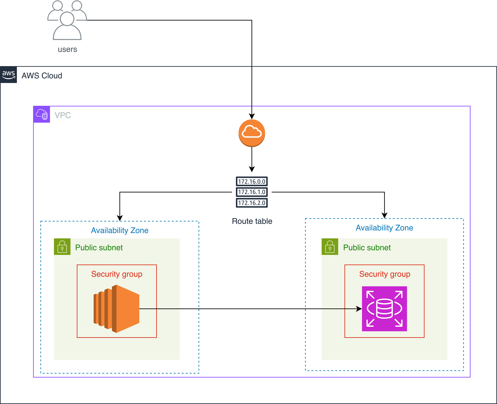

# MIRUNI_Backend

> **미루는 습관을 개선시켜주는 습관 관리 앱** 

## 📱 프로젝트 소개

**MIRUNI**는 사용자의 미루는 습관을 개선하고 효율적인 시간 관리를 도와주는 습관 관리 애플리케이션입니다.

- **AI 기반 일정 분할**: 복잡한 일정을 단계별로 나누어 관리
- **땅콩 시스템**: 목표 달성 시 땅콩을 획득하여 동기부여
- **실시간 알림**: FCM을 통한 스마트한 알림 시스템
- **데이터 분석**: 월간 리포트를 통한 습관 개선 현황 파악

## 🛠️ 기술 스택

### Backend
- **Framework**: Spring Boot 3.5.3
- **Language**: Java 17
- **Database**: MySQL 8.0
- **Cache**: Redis
- **Build Tool**: Gradle
- **CI/CD**: GitHub Actions

### AI & External
- **AI Service**: Perplexity AI API
- **Push Notification**: Firebase Cloud Messaging (FCM)
- **Email**: Spring Mail

### Infrastructure
- **Cloud**: AWS (EC2, RDS)
- **Container**: Docker
- **Monitoring**: Spring Actuator

## 📁 프로젝트 구조

```
src/main/java/dgu/umc_app/
├── domain/                    # 도메인별 패키지
│   ├── user/                 # 사용자 관리
│   ├── plan/                 # 일정 관리
│   ├── fcm/                  # 푸시 알림
│   ├── report/               # 리포트 생성
│   ├── review/               # 일정 리뷰
│   └── question/             # 사용자 문의
├── global/                    # 공통 설정
│   ├── config/               # 설정 클래스
│   ├── exception/            # 예외 처리
│   ├── response/             # 응답 형식
│   └── authorize/            # 인증/인가
└── MiruniApplication.java    # 메인 클래스
.
.
.
```

## 🌿 브랜치 전략

- **main**: 프로덕션 배포용
- **dev**: 개발 통합용
- **feature/**: 기능 개발용
- **hotfix/**: 긴급 수정용

## 👥 팀원 정보

| 역할 | 닉네임 | 이름 |
|------|--------|------|
| **Plan** | 가용 | 김가영 |
| **Design** | 유나 | 박유나 |
| **Android** | 무무 | 문설빈 |
| **Android** | 환 | 이창환 |
| **Android** | 콩 | 사혜빈 |
| **Spring Boot** | 쉬프 | 양희진 |
| **Spring Boot** | 루크 | 김도훈 |
| **Spring Boot** | 추 | 추상윤 |
| **Spring Boot** | 조이 | 박찬미 |
| **Spring Boot** | 해피 | 장수현 |


## 🏗️ 서버 아키텍처



## 📄 마무리

이 프로젝트는 UMC 8기 프로젝트입니다.

**MIRUNI**와 함께 습관을 개선하고 더 나은 삶을 만들어가세요! 🌟